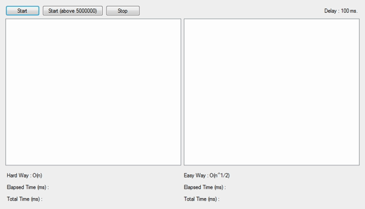
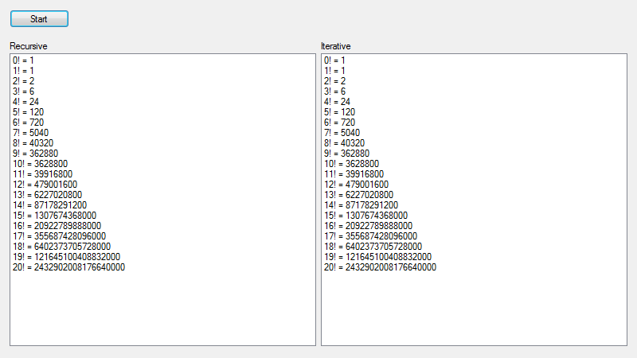
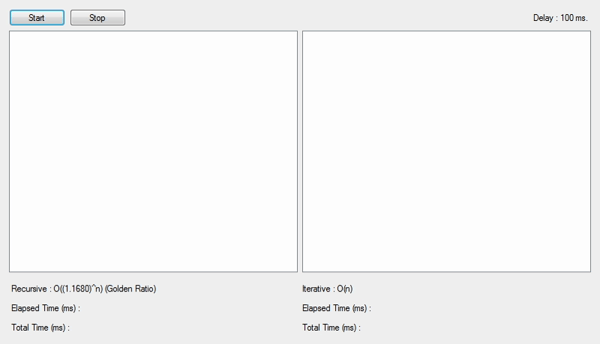

# Data Structures Library

Data Structures Library - 2018 (C# - Java)

<h2>Abstract Data Types</h2>
<ul>
  
  <li>
    <h3>Balanced Parentheses Stack</h3>
    <ul>
      <li>BalancedParenthesesStack(int size)</li>
      <li>bool Push(char parenthesis)</li>
      <li>void Pop()</li>
    </ul>
  </li>
  
  <li>
    <h3>Priority Queue</h3>
    <ul>
      <li>PriorityQueue(int size)</li>
      <li>bool isEmpty()</li>
      <li>bool isFull()</li>
      <li>int Count()</li>
      <li>void Enqueue(int value)</li>
      <li>void Dequeue()</li>
      <li>void Print()</li>
    </ul>
  </li>
  
  <li>
    <h3>Queue</h3>
    <ul>
      <li>Queue(int size)</li>
      <li>bool isEmpty()</li>
      <li>bool isFull()</li>
      <li>int Count()</li>
      <li>void Enqueue(int value)</li>
      <li>void Dequeue()</li>
      <li>int Front()</li>
    </ul>
  </li>
    
  <li>
    <h3>Stack</h3>
    <ul>
      <li>Stack(int size)</li>
      <li>bool isEmpty()</li>
      <li>int Count()</li>
      <li>void Push(int value)</li>
      <li>void Pop()</li>
      <li>int Top()</li>
    </ul>
  </li>
  
</ul>

<h2>Algorithm Analysis</h2>

There is a program for finding prime numbers with 2 ways in here. First way is easy way to find it and its Big O notation is O(n^1/2), second way is hard way to find it and its Big O notation is O(n).

<h2>Graph</h2>
<ul>
  
  <li>
    <h3>Graph</h3>
    <ul>
      <li>Graph(int vertexCount)</li>
      <li>void addEdge(int src, int dest)</li>
      <li>void DFS(int s)</li>
      <li>void DFSUtil(int s,boolean visited[])</li>
      <li>void BFS(int s)</li>
      <li>void Print()</li>
    </ul>
  </li>
  
  <li><h3>DijkstraSP</h3></li>
</ul>

<h2>Heap</h2>
<ul>
  
  <li>
    <h3>HeapMin</h3>
    <ul>
      <li>HeapMin(int size)</li>
      <li>int getLeftChildIndex(int parentIndex)</li>
      <li>int getRightChildIndex(int parentIndex)</li>
      <li>int getParentIndex(int childIndex)</li>
      <li>bool hasLeftChild(int index)</li>
      <li>bool hasRightChild(int index)</li>
      <li>bool hasParent(int index)</li>
      <li>int leftChild(int index)</li>
      <li>int rightChild(int index)</li>
      <li>int parent(int index)</li>
      <li>void Swap(int index1, int index2)</li>
      <li>void EnsureMaxCapacity()</li>
      <li>void EnsureMinCapacity()</li>
      <li>Front()</li>
      <li>Remove()</li>
      <li>Add(int value)</li>
      <li>HeapifyDown()</li>
      <li>HeapifyUp()</li>
    </ul>
  </li>
  
</ul>

<h2>Linked List</h2>
<ul>
  
  <li>
    <h3>Circular Linked List</h3>
    <li>
      <h4>Circular Linked List</h4>
      <ul>
        <li>CircularLinkedList()</li>
        <li>CircularLinkedList(int inital)</li>
        <li>void Add(int value, int position)</li>
        <li>void Add(int value)</li>
        <li>void Remove(int position)</li>
        <li>void Clear()</li>
      </ul>
    </li>
    <li>
      <h4>Node</h4>
      <ul>
        <li>Node(int value)</li>
      </ul>
    </li>
  </li>
  
  <li>
    <h3>Doubly Linked List</h3>
    <li>
      <h4>Doubly Linked List</h4>
      <ul>
        <li>DoublyLinkedList()</li>
        <li>DoublyLinkedList(int inital)</li>
        <li>void Add(int value, int position)</li>
        <li>void Add(int value)</li>
        <li>void Remove(int position)</li>
        <li>void Clear()</li>
      </ul>
    </li>
    <li>
      <h4>Node</h4>
      <ul>
        <li>Node(int value)</li>
      </ul>
    </li>
  </li>
  
  <li>
    <h3>Singly Linked List</h3>
    <li>
      <h4>Singly Linked List</h4>
      <ul>
        <li>SinglyLinkedList()</li>
        <li>SinglyLinkedList(int inital)</li>
        <li>bool isEmpty()</li>
        <li>int Count()</li>
        <li>void Add(int value, int position)</li>
        <li>void Add(int value)</li>
        <li>void Remove(int position)</li>
        <li>void Clear()</li>
        <li>void Reverse()</li>
        <li>int IndexOf(int value)</li>
        <li>int Get(int position)</li>
        <li>void Combine(SinglyLinkedList singlyLinkedList)</li>
        <li>void Print()</li>
      </ul>
    </li>
    <li>
      <h4>Node</h4>
      <ul>
        <li>Node(int value)</li>
      </ul>
    </li>
  </li>
  
</ul>

<h2>Recursion</h2>
<ul>
  
  <li>
    <h3>Factorial</h3>
    
There is a program for calculating factorial with 2 ways in here. First way uses recursion, second way uses iteration. 

    
  </li>
  
  <li>
    <h3>Fibonacci</h3>
    
There is a program for calculating fibonacci numbers sequence with 2 ways in here. First way uses recursion and its Big O notation is O((1.1680)^n) (Golden Ratio), second way uses iteration and its Big O notation is O(n). 

    
  </li>
  
</ul>

<h2>Sorting Algorithm</h2>
<ul>
  
  <li>
    <h3>Bubble Sort</h3>
    <ul>
      <li>void BubbleSort(int[] array, int length)</li>
    </ul>
  </li>
  
  <li>
    <h3>Insertion Sort</h3>
    <ul>
      <li>void InsertionSort(int[] array, int length)</li>
    </ul>
  </li>
  
  <li>
    <h3>Merge Sort</h3>
    <ul>
      <li>void MergeSort(int[] array, int length)</li>
      <li>void Split(int[] array, int length)</li>
      <li>void Merge(int[] left, int[] right, int[] array)</li>
    </ul>
  </li>
  
  <li>
    <h3>Quick Sort</h3>
    <ul>
      <li>void QuickSort(int[] array, int start, int end)</li>
      <li>int Partition(int[] array, int start, int end)</li>
    </ul>
  </li>
  
  <li>
    <h3>Selection Sort</h3>
    <ul>
      <li>void SelectionSort(int[] array, int length)</li>
    </ul>
  </li>
  
</ul>

<h2>Tree</h2>
<ul>
  
  <li>
    <h3>Binary Search Tree</h3>
    <li>
      <h4>Binary Search Tree</h4>
      <ul>
        <li>BinarySearchTree()</li>
        <li>BinarySearchTree(int inital)</li>
        <li>bool isEmpty()</li>
        <li>Node Search(int value)</li>
        <li>Node FindMax(int startingRoot)</li>
        <li>Node FindMin(int startingRoot)</li>
        <li>int FindHeight(int startingRoot)</li>
        <li>void Add(int value)</li>
        <li>void Remove(int value)</li>
        <li>void InOrder(int startingRoot)</li>
        <li>void PreOrder(int startingRoot)</li>
        <li>void PostOrder(int startingRoot)</li>
        <li>void LevelOrder(int startingRoot)</li>
      </ul>
    </li>
    <li>
      <h4>Node</h4>
      <ul>
        <li>Node(int value)</li>
      </ul>
    </li>
  </li>
  
</ul>
